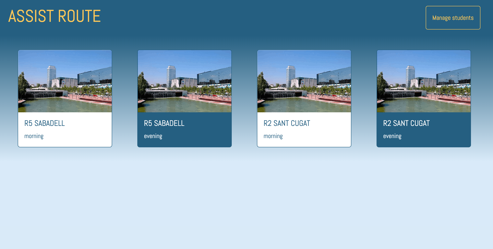
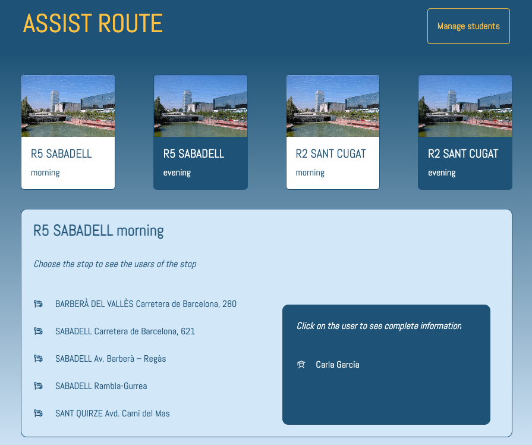
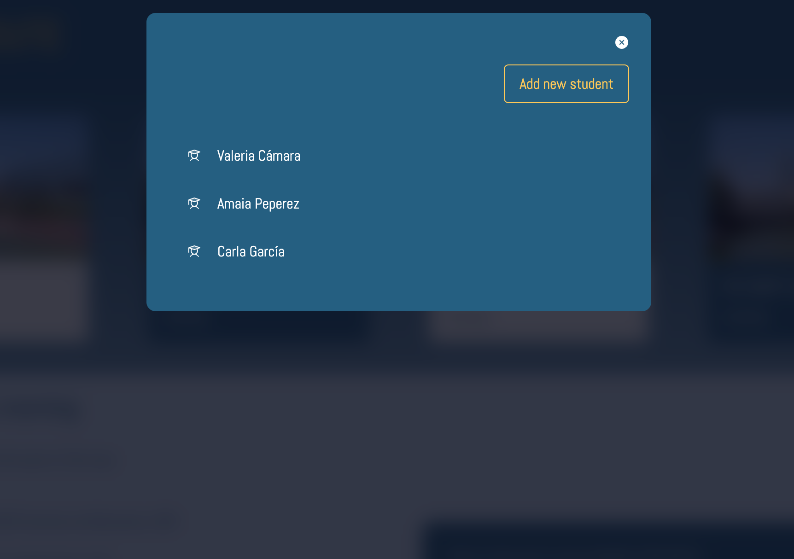
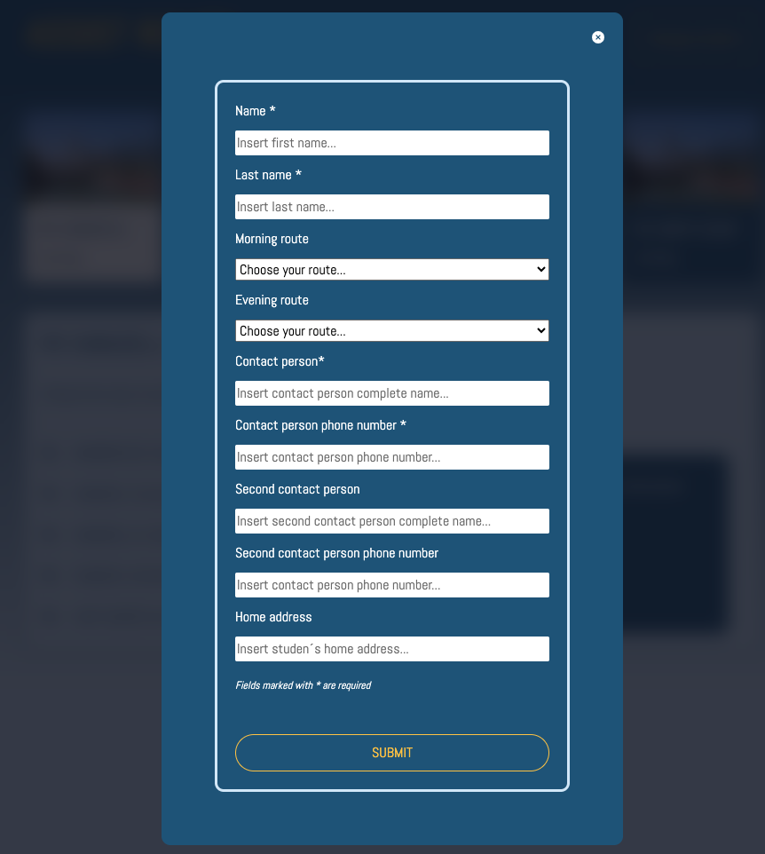
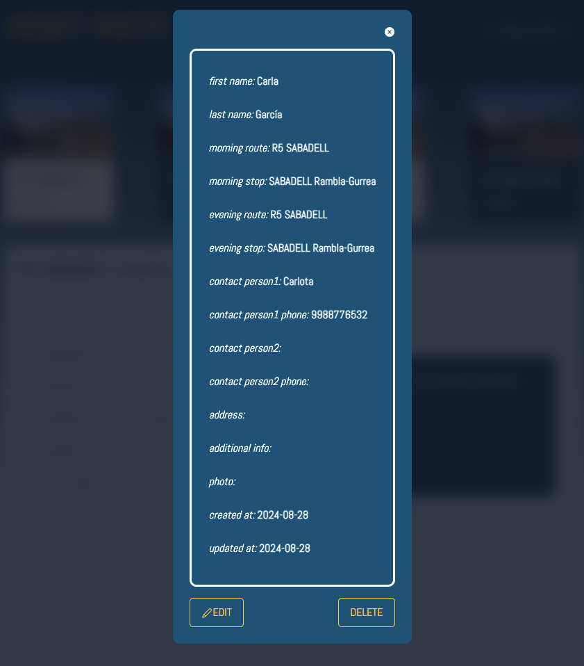

# Assist Route
Assist Route is an application that helps the school bus assistant manage the attendance of students who use the bus, the stops and routes they use and be able to quickly contact the students or their legal guardians.



## Features:

🚏 Display information about the stops on the selected route.



🎓 Display with information about the students who take the bus at the selected stop.



✏️ Add new students.



🔍 Check, modify, and delete student data.



## Technologies Used

* Backend:
  


* Frontend:


# Getting started

# Server

1. Clone this repository into your local:
```
git clone https://github.com/your-username/asist-route.git
```
2. Navigate to the server directory and install server dependencies:
```
cd asist-route/server
npm install
```
3. To use a database you need to first install it on your computer. For this project you will need [PostgreSQL](https://postgresql.org/) as well as [Sequelize] (https://sequelize.org).
Through the CLI, check what DBs already exist in your SQL instance, create one for this app, and update data in the file 'server/models/index.js'.

4. Start the backend server:
```
npm start
```

# Client

5. Navigate to the client directory and install the dependencies for the frontend::
```
cd ../client
npm install
```
6. Start the development server:
```
npm run dev
```
7. Open your browser and visit `http://localhost:5173` to access the application.


